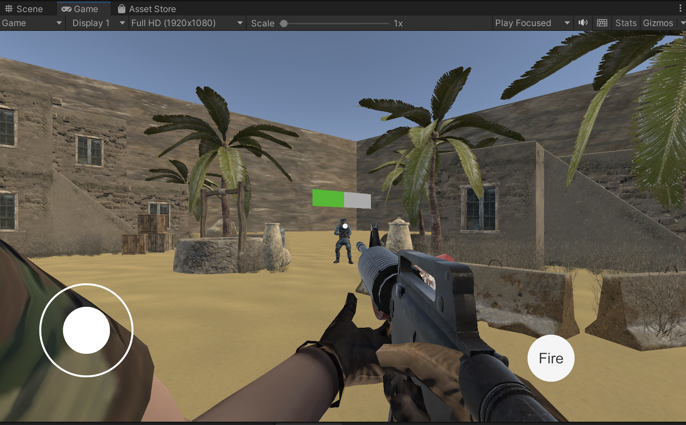

# How to run this project

This project is developed using **Unity 2021.3.21f1**,
so you can open and build this project using Unity 2021.3.21f1 and above.

## Replace Photon App Id

Locate `Assets/Photon/PhotonUnityNetworking/Resources/PhotonServerSettings.asset` and replace `App Id PUN` with your dev appId.

## How to build this demo

Open `Build Settings` from `File > Build Settings` and Add `Scenes/LobbyScene` and `Scenes/GameScene` into **Scenes Into Build**

Select your test platform. This project is build for Android device but works on Windows/Mac machines as well. So you can select default `Windows, Mac, Linux` as target platform. Then click Build and select a folder to save the built app.

Note: `LobbyScene` must have build index of 0 or the project won't work properly!!!

## How to test this game

### Unity side

- Open `LobbyScene` in Unity and click run button.

- Enter a user name as you like and press `LOGIN` Button

- Select `Create Room`

- Enter a room name and max players (<= 20) and press `Create Room` button.

### Built app side

- Open the app you built at **How to build this demo** step.
- Same as Unity side step 2, enter a user name and press `LOGIN` button.

- Select `Show Room List` button

- You will see the room you just created before. Click `Join` button.

You will see the joined user list on both app side and unity side.

Back to Unity, click `Start Game` button.

You will see the game scene. you can update the current camera view by dragging mouse in the read area, moving your character by pulling the thumbstick simulator on bottom-left screen and fire by pressing `Fire` button

Once you aim at your opponent, you can fire at him and he will die when his HP decreases to 0 and will respawn after 6 seconds.

Fire your opponent

Dead screen

Opponent dying
